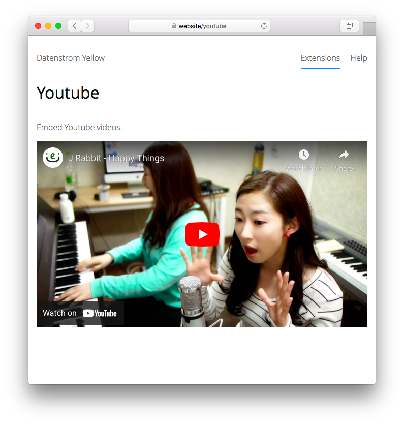

<a href="README-de.md">Deutsch</a> &nbsp; <a href="README.md">English</a> &nbsp; <a href="README-sv.md">Svenska</a>

# Youtube 0.8.7

Youtube-Videos einbinden.

## Wie man eine Erweiterung installiert

[ZIP-Datei herunterladen](https://github.com/annaesvensson/yellow-youtube/archive/refs/heads/main.zip) und in dein `system/extensions`-Verzeichnis kopieren. [Weitere Informationen zu Erweiterungen](https://github.com/annaesvensson/yellow-update/tree/main/README-de.md).

## Wie man ein Video einbindet

Erstelle eine `[youtube]`-Abkürzung. 

Die folgenden Argumente sind verfügbar, alle bis auf das erste Argument sind optional:
 
`Id` = der letzte Teil eines [Youtube](https://www.youtube.com)-Links, z.B. `https://www.youtube.com/watch?v=fhs55HEl-Gc`  
`Style` = Videostil, z.B. `left`, `center`, `right`  
`Width` = Videobreite, Pixel oder Prozent  
`Height` = Videohöhe, Pixel oder Prozent  

Du solltest wissen, dass der Dienstanbieter personenbezogene Daten sammelt und Cookies benutzt.

## Beispiele

Video einbinden, unterschiedliche Videos:

    [youtube fhs55HEl-Gc]
    [youtube wNiyp89pTi0]
    [youtube OV5J6BfToSw]

Video einbinden, unterschiedliche Größen:

    [youtube fhs55HEl-Gc right 50%]
    [youtube fhs55HEl-Gc right 200 112]
    [youtube fhs55HEl-Gc right 400 224]

## Einstellungen

Die folgenden Einstellungen können in der Datei `system/extensions/yellow-system.ini` vorgenommen werden:

`YoutubeStyle` = Videostil, z.B. `flexible`  

## Danksagung

Diese Erweiterung verwendet [Youtube](https://www.youtube.com) von Google. Danke für den kostenlosen Service.

## Entwickler

Anna Svensson. [Hilfe finden](https://datenstrom.se/de/yellow/help/).
